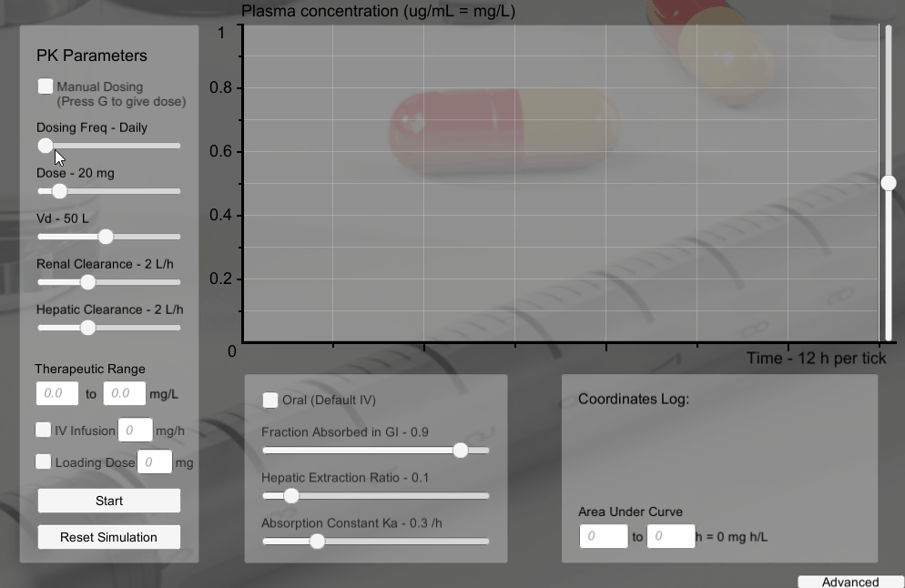

# Pharmacokinetic-sym

Pharmacokinetic-sym is a graphical pharmacokinetic simulator for educational use.

## Getting Started

These instructions will get you a copy of the project up and running on your local machine.

### Prerequisites

- Windows Operating System

### Installation

Download a copy of the repository to your local system (using either terminal or manually on GitHub):

```bash
git clone https://github.com/sladem-tox/Pharmacokinetic-sym
```

Extract the contents of the repository.

Double-click the file ```PK Graph.exe``` to open the simulator

Now various Pharmacokinetic parameters may be adjusted and simulated:



## PK Graph Guide
A small [guide](PK%20Graph%20Guide.pdf) describes using the simulator.

## Built With

* [Unity](https://unity.com/)

## License

This project is licensed under the GNU General Public License v3 - see the [LICENSE.md](LICENSE.md) file for details
